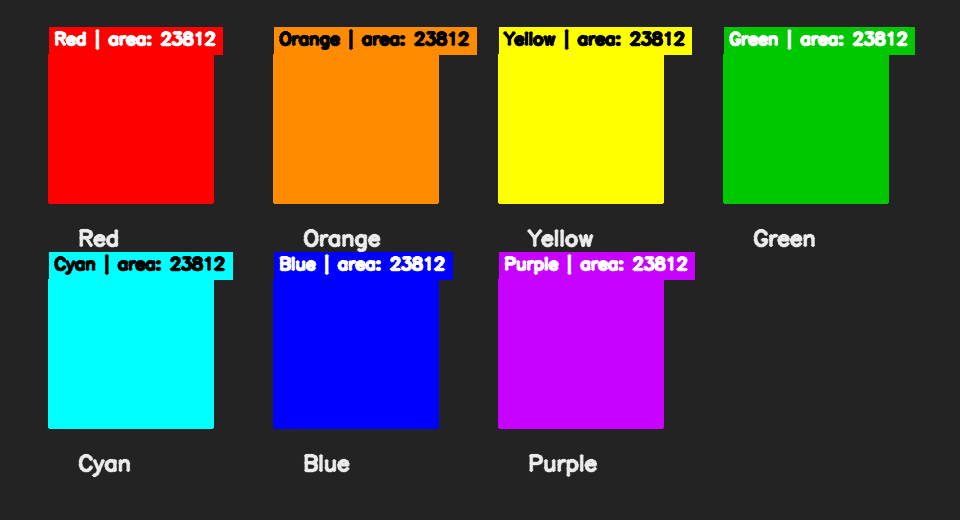

# OpenCV Color Recognition — Nasser Mamdouh Alshareef

**Prepared by / إعداد الطالب:** **ناصر ممدوح الشريف**  
**English name:** **Nasser Mamdouh Alshareef**

This repository contains one complete OpenCV project for the **Color
Recognition** task. It recognizes colored objects from a live webcam or a still
image and draws the color name, bounding box, center point, and detected area.

The project uses **Anaconda** as the virtual environment and is ready to run in
**Visual Studio Code**.



## Selected task

- OpenCV task: **Color Recognition**
- HuskyLens project: not included because it is a separate optional project

## Recognized colors

Red, Orange, Yellow, Green, Cyan, Blue, and Purple.

## Project files

| File | Purpose |
| --- | --- |
| `AUTHOR.txt` | Student name and project ownership |
| `main.py` | Program entry point for webcam and still-image modes |
| `color_detector.py` | HSV masks, contour detection, and annotations |
| `generate_demo.py` | Recreates and validates the sample images |
| `tests/test_color_detector.py` | Automated tests for all seven colors and error cases |
| `environment.yml` | Reproducible Anaconda environment |
| `requirements.txt` | Python dependency list |
| `assets/sample_input.png` | Included sample image |
| `assets/demo_result.png` | Validated color-recognition output |
| `README.md` | Complete setup, algorithm, testing, and GitHub instructions |

## How the project works

1. OpenCV reads a frame from the webcam or an image file.
2. A Gaussian blur reduces small camera noise.
3. The frame is converted from BGR to HSV color space.
4. `cv2.inRange` creates a binary mask for every configured color.
5. Morphological opening and closing remove noise and fill small holes.
6. `cv2.findContours` locates the colored regions.
7. Regions smaller than the minimum area are ignored.
8. The program draws a box, center point, color name, and area for every result.

HSV is used because hue separates color from brightness better than raw BGR
values. Red uses two HSV ranges because OpenCV's hue scale wraps at 0 and 179.

## Requirements

- Anaconda or Miniconda
- Visual Studio Code
- VS Code Python extension
- A webcam for the live demonstration

## Installation with Anaconda

Open **Anaconda Prompt**, move to the project folder, and run:

```bash
conda env create -f environment.yml
conda activate opencv-color-recognition
code .
```

In Visual Studio Code:

1. Press `Ctrl+Shift+P`.
2. Select **Python: Select Interpreter**.
3. Select the interpreter named **opencv-color-recognition**.
4. Open the VS Code terminal and confirm that the environment name appears.

If the environment was already created, update it with:

```bash
conda env update -f environment.yml --prune
```

## Run the live webcam project

```bash
python main.py
```

Hold a red, orange, yellow, green, cyan, blue, or purple object in front of the
camera. The program displays its name and location.

Controls:

- `Q` or `Esc`: close the program
- `S`: save the current annotated frame as `captured_result.jpg`

To use another camera:

```bash
python main.py --camera 1
```

## Run the included sample without a webcam

```bash
python main.py --image assets/sample_input.png --output assets/my_result.png
```

For a computer without a graphical display:

```bash
python main.py --image assets/sample_input.png --output assets/my_result.png --no-display
```

## Run the automated tests

The tests create artificial colored images and verify all seven colors, the
minimum-area filter, input protection, and error handling.

```bash
python -m unittest discover -s tests -v
```

Expected result:

```text
Ran 5 tests
OK
```

## Recreate the demonstration images

```bash
python generate_demo.py
```

The script also checks that all seven colors are recognized before saving the
result.

## Useful options

```bash
python main.py --help
python main.py --min-area 2000
python main.py --camera 1 --no-mirror
python main.py --camera 0 --output saved_frame.jpg
```

`--min-area` is useful when small colored reflections are detected. A larger
value ignores more small regions.

## Troubleshooting

### The webcam does not open

- Close applications that are already using the camera.
- Allow camera access for desktop applications in the operating-system privacy
  settings.
- Try `python main.py --camera 1` if the computer has more than one camera.

### A color is not detected correctly

- Use good, neutral lighting and avoid strong reflections.
- Move the object closer to the camera.
- Lower the area threshold, for example: `python main.py --min-area 500`.
- HSV limits can be calibrated in `DEFAULT_COLOR_PROFILES` inside
  `color_detector.py` for a specific camera or room.

### `ModuleNotFoundError: No module named 'cv2'`

Activate the correct environment and install the dependencies:

```bash
conda activate opencv-color-recognition
python -m pip install -r requirements.txt
```

## Upload the project to GitHub

1. Create an empty GitHub repository named
   `nasser-mamdouh-alshareef-opencv-color-recognition`.
2. Open a terminal inside this project folder.
3. Run the following commands, replacing `<YOUR_USERNAME>` with the GitHub
   username:

```bash
git init
git add .
git commit -m "Add OpenCV color recognition project"
git branch -M main
git remote add origin https://github.com/<YOUR_USERNAME>/nasser-mamdouh-alshareef-opencv-color-recognition.git
git push -u origin main
```

After the push, verify that GitHub shows `README.md`, the source files, the test
folder, and both images in `assets`.

---

## شرح مختصر بالعربي

هذا المشروع ينفذ مهمة **التعرف على الألوان باستخدام OpenCV**. يقرأ البرنامج
الصورة من الكاميرا، ويحوّلها من BGR إلى HSV، ثم ينشئ قناعًا لكل لون وينظفه،
ويستخرج حدود الأجسام الملونة. بعد ذلك يعرض اسم اللون ومربعًا حول الجسم ونقطة
المركز والمساحة.

خطوات التشغيل المختصرة من Anaconda Prompt:

```bash
conda env create -f environment.yml
conda activate opencv-color-recognition
code .
python main.py
```

للخروج اضغط `Q` أو `Esc`، ولحفظ لقطة من الكاميرا اضغط `S`.
